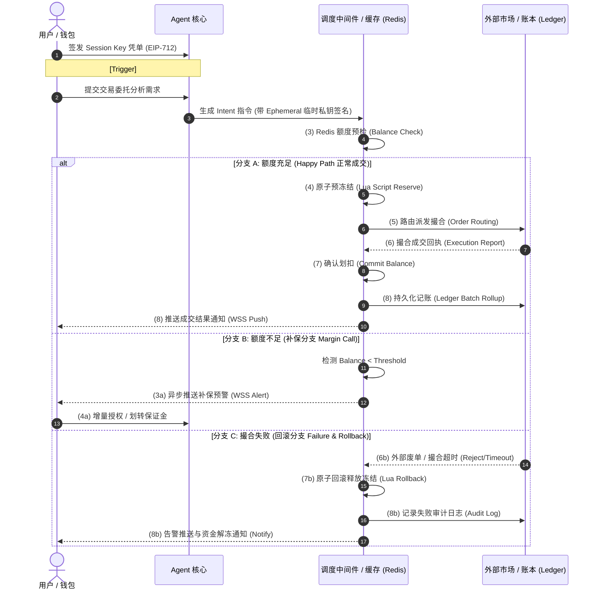
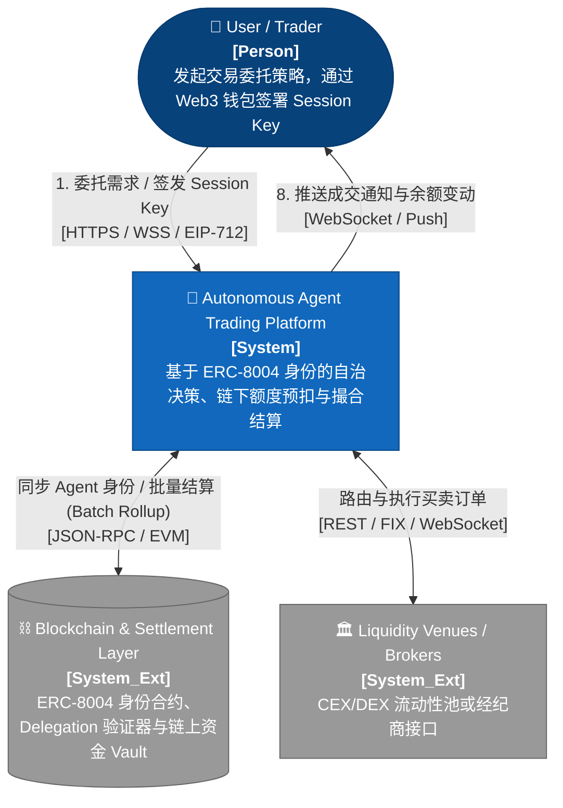
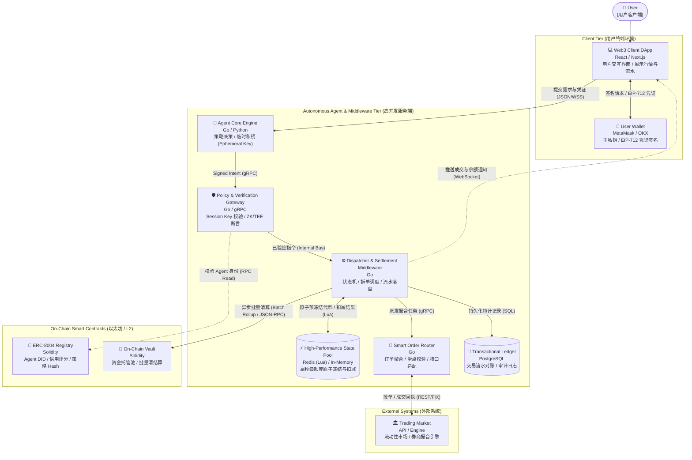
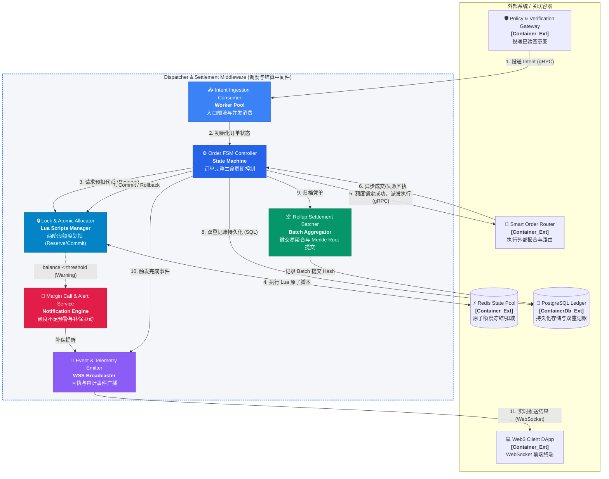

# [RFC-001] 自治 Agent 交易与链下高性能清结算系统技术架构设计全案

> ⚠️ **本文是「输入材料」，不是待实现的规格。** 它的取舍已由 `docs/adr/ADR-004` 裁决（2026-10-08）：
> **不照搬**——gRPC/proto、Docker、Redis Lua 预扣均不采纳（§4.2.1 的 Lua 有 4 个实测缺陷，见 GAP-18~21）；
> **只复用三处**——§4.2.2 的 `settlement_ledger` DDL、§3.4 的 ZK Validator 空接口、§1.2 的 EIP-712 授权语义
> （改为升级既有 `agentcard`，而非新建）。**正文保持原样，未做改写**——它是历史留痕。

## 1. 项目立项与痛点推导（Problem Discovery）

### 1.1 业务愿景与核心痛点

随着生成式人工智能与自主代理（Autonomous Agent）技术向量化金融、高频资产配置领域渗透，传统的 Web3 交互范式面临着根本性冲突：

- **单次交互弹窗破坏自治性（Autonomous Void）**：传统 Web3 DApp 依赖外部拥有账户（EOA）的主私钥对每笔交易逐一签名确认。当委托 Agent 进行毫秒级市场分析并捕捉瞬时套利机会时，频繁唤起钱包签名弹窗直接切断了全自动执行流，使“自治代理”退化为普通“手动点单工具”。
- **链上直接结算无法承载高并发与低延迟（Latency & Throughput Bottleneck）**：公链底层（即便包含高性能 L2/L3）存在出块间隔、共识延迟、Gas 波动及状态竞争等物理限制。如果在 Agent 每一步操作中均执行链上 Token 扣划与状态转移，单笔交易确认延迟将高达数百毫秒至数秒，引发严重的交易滑点，且无法抵御市场微观结构中的高频竞争。
- **黑盒托管与越权风险（Custody & Authorization Dilemma）**：中心化托管 Agent 私钥或完全信任中心化中间件，违背了非托管（Non-custodial）的 Web3 信任假设；而直接赋予智能合约无上限授权（Infinite ERC-20 Approve）则面临严重的资金池被耗尽风险。

### 1.2 方案可行性推演

为解决上述痛点，系统确立了两大核心技术原语：

1. **ERC-8004 链上身份体系结合 Session Key 细粒度委托授权**：
   - 将 Agent 实体建模为链上独立登记的去中心化身份（DID），持有策略哈希（Policy Hash）与信用评分（Credit Score）。
   - 采用基于密码学约束的会话密钥（Session Key）技术，用户主钱包仅需签发带有确定性上下文边界（限额、标的白名单、有效周期）的 EIP-712 委托凭证，授予 Agent 本地生成的临时私钥（Ephemeral Key），在保障资金主权的前提下实现真正的无感自治执行。
2. **链下高速状态通道预扣与双重清结算模型**：
   - 借鉴传统金融撮合系统的高性能设计，在链下设立高性能 Token 状态池，通过内存引擎与原子操作（Lua 脚本）实现毫秒级的两阶段额度划扣（预冻结 Reserve $\to$ 提交 Commit / 回滚 Rollback）。
   - 将外部市场撮合、链下高频微结算与链上资金沉淀解耦，交易高频流水在链下流转，最终资金通过批量归纳（Batch Rollup）定期结算至链上 Vault 合约，达成吞吐量与最终安全性的统一。

## 2. 需求工程与边界分析（Requirements Engineering）

### 2.1 核心用例与用户旅程



- **Happy Path（主成功路径）**：
  1. 用户在前端 DApp 选定策略周期，主钱包一次性签署 EIP-712 委托凭单。
  2. Agent 基于行情指标生成决策，使用绑定的 Ephemeral Key 对交易意图（Trading Intent）签名并投递至验证网关。
  3. 验证网关校验委托范围合法后，中间件通过原子 Lua 脚本在 Redis Token 池中预冻结对应额度。
  4. 智能路由向外部市场提交报单，撮合成交后返回成功回执。
  5. 中间件确认扣款（Commit），将流水写入 PostgreSQL 双重记账表，通过 WebSocket 异步推送成交通知给客户端。
- **补保分支（Insufficient Balance Path）**：
  1. Token 池执行预冻结时发现可用额度低于本次开销或触碰警戒水位。
  2. 订单状态置为 `PENDING_AUTHORIZATION`，调度器触发 `Margin Call` 事件。
  3. 系统通过长连接唤起前端客户端展示追加授信或充值通知；用户钱包完成增量授权后唤醒原流程。
- **回滚分支（Revert / Failover Path）**：
  1. 额度预扣成功后，外部撮合引擎因市场剧烈波动、流动性匮乏或滑点超标返回废单（Rejected/Expired）。
  2. 中间件状态机拦截异常，触发原子释放指令（Rollback），解除资金冻结状态并归还至可用余额。
  3. 异常状态持久化落盘，并向用户告警。

### 2.2 非功能性需求（NFRs）

- **并发吞吐量（Throughput）**：链下额度校验与冻结核心模块支持不低于 10,000 TPS 的并发判定能力。
- **处理延迟（Latency）**：意图验证、风控校验到完成链下额度冻结的端到端 P99 延迟控制在 15ms 以内。
- **资金一致性与防超扣（Zero Over-allocation）**：在高并发竞态场景下，严格保证单用户并发扣款不超过授权上限，消除负余额与超额划扣。
- **密码学信任边界（Cryptographic Boundaries）**：
  - Agent 仅持有低权限临时私钥，无权提取或转移底层 Vault 中的主资金资产。
  - 外部合约或验证网关可随时基于公开数学算法独立还原校验 EIP-712 签名有效性，无需中心化依赖。

## 3. 宏观系统架构设计（C4 Model）

### 3.1 Level 1: System Context（系统上下文图）



### 3.2 Level 2: Container Diagram（容器架构图）



### 3.3 Level 3: Component Diagram（核心中间件组件图）

代码段



### 3.4 架构决策要点对照表

| **核心诉求 / 评审维度**             | **传统方案缺陷**                                             | **本案架构落地设计**                                         | **核心价值收益**                                             |
| ----------------------------------- | ------------------------------------------------------------ | ------------------------------------------------------------ | ------------------------------------------------------------ |
| **Agent 信任与身份机制 (ERC-8004)** | 缺乏链上主体，或依赖中心化 API Key 鉴权，无法公开验证身份与约束边界。 | 链上建立 `ERC-8004 Registry` 确立 Agent DID，结合客户端 `Session Key` 凭单授予特定执行域（Scope）。 | 杜绝私钥泄露导致的无限越权，实现数学级别的最小特权原则（PoLP）。 |
| **高性能实时结算**                  | 链上直扣吞吐极低（<50 TPS）、延迟长，无法支撑高频与量化撮合。 | 链下 `Redis In-Memory State Channel` 执行两阶段预扣（Reserve-Commit），撮合完成后异步批量 `Rollup`。 | 核心结算判定降低至毫秒级，实现 10,000+ TPS 吞吐，彻底隔绝链上拥堵。 |
| **可验证性与 ZK 演进**              | Agent 推理与风控规则黑盒运行，易引发操纵市场与虚假申报质疑。 | 网关层抽象 `Pluggable Policy Validator` 规范，实现策略断言与 TEE/zkML 证明验证插槽。 | 当前保障工程代码高并发闭环，架构上天然无缝对接 zk-SNARKs / RISC Zero 验证扩展。 |

## 4. 详细技术设计与契约定义（Detailed Design & Contracts）

### 4.1 接口与通信契约

#### 4.1.1 EIP-712 Session Key 委托凭单结构规范

客户端签发时遵循的标准类型化数据契约：

```json
{
  "types": {
    "EIP712Domain": [
      { "name": "name", "type": "string" },
      { "name": "version", "type": "string" },
      { "name": "chainId", "type": "uint256" },
      { "name": "verifyingContract", "type": "address" }
    ],
    "AgentDelegation": [
      { "name": "userAddress", "type": "address" },
      { "name": "agentId", "type": "bytes32" },
      { "name": "sessionPublicKey", "type": "address" },
      { "name": "maxSpendPerTx", "type": "uint256" },
      { "name": "dailySpendLimit", "type": "uint256" },
      { "name": "validUntil", "type": "uint64" },
      { "name": "nonce", "type": "uint256" }
    ]
  },
  "primaryType": "AgentDelegation",
  "domain": {
    "name": "AutonomousAgentTradingSettlement",
    "version": "1",
    "chainId": 1,
    "verifyingContract": "0xCcCCccccCCCCcCCCCCCcCcCccCcCCCcCcccccccC"
  }
}
```

#### 4.1.2 核心 gRPC 通信契约 (`api/proto/autonomous/trading/v1/trading_engine.proto`)

```protobuf
syntax = "proto3";

package autonomous.trading.v1;

option go_package = "trading/v1;tradingv1";

// 意图验证与派发服务
service IntentService {
  rpc SubmitTradingIntent (TradingIntentRequest) returns (TradingIntentResponse);
}

// 高性能结算控制服务
service SettlementService {
  rpc ReserveToken (ReserveTokenRequest) returns (ReserveTokenResponse);
  rpc CommitToken (CommitTokenRequest) returns (CommitTokenResponse);
  rpc RollbackToken (RollbackTokenRequest) returns (RollbackTokenResponse);
}

message DelegationScope {
  string session_public_key = 1;
  string max_spend_per_tx = 2;
  string daily_spend_limit = 3;
  uint64 valid_until = 4;
  uint64 nonce = 5;
  bytes eip712_signature = 6;
}

message TradingIntentRequest {
  string intent_id = 1;
  string user_address = 2;
  string agent_id = 3;
  string symbol = 4;
  string side = 5;                 // "BUY" 或 "SELL"
  string amount = 6;               // 交易数量 (标的)
  string limit_price = 7;          // 委托限价
  string max_slippage_bps = 8;     // 允许滑点，单位基点 (e.g. 50 = 0.5%)
  string estimated_token_fee = 9;  // 本次预计需要扣划的结算 Token
  bytes session_signature = 10;    // Agent 临时私钥针对本 Payload 的签名
  uint64 timestamp = 11;
  DelegationScope delegation = 12; // 附带的有效委托上下文
}

message TradingIntentResponse {
  string intent_id = 1;
  enum IntentStatus {
    INTENT_STATUS_UNSPECIFIED = 0;
    ACCEPTED_AND_ROUTED = 1;
    PENDING_RESERVE = 2;
    INSUFFICIENT_ALLOWANCE = 3;
    SIGNATURE_INVALID = 4;
    EXCEEDED_DELEGATION_LIMIT = 5;
  }
  IntentStatus status = 2;
  string message = 3;
}

message ReserveTokenRequest {
  string intent_id = 1;
  string user_address = 2;
  string amount = 3;
  uint32 lock_timeout_sec = 4;
}

message ReserveTokenResponse {
  bool success = 1;
  string reserved_amount = 2;
  string remaining_available = 3;
  bool requires_top_up = 4;
  string failure_reason = 5;
}

message CommitTokenRequest {
  string intent_id = 1;
  string user_address = 2;
  string actual_settled_amount = 3;
}

message CommitTokenResponse {
  bool success = 1;
  string final_balance = 2;
}

message RollbackTokenRequest {
  string intent_id = 1;
  string user_address = 2;
  string reason = 3;
}

message RollbackTokenResponse {
  bool success = 1;
  string restored_balance = 2;
}
```

### 4.2 存储与数据建模

#### 4.2.1 Redis 高性能状态模型及 Lua 原子脚本

**Redis 数据结构映射**：

- 用户资产核心 Hash：`user:balance:{user_address}`
  - `available`: 可用代币额度（字符串形式的高精度浮点/整型）。
  - `reserved`: 当前冻结中额度。
  - `daily_spent`: 当日已消耗额度（重置窗口 86400 秒）。
- 冻结凭单 Key：`order:freeze:{intent_id}`
  - 设带有效期的状态值，防止撮合挂起导致死锁：`SETEX order:freeze:{intent_id} 30 "{user_address}:{amount}"`。

**原子预扣脚本 (`scripts/lua/reserve_token.lua`)**：

```lua
-- KEYS[1]: user balance key (e.g. user:balance:0x1234...)
-- KEYS[2]: order freeze key  (e.g. order:freeze:uuid-xxxx)
-- ARGV[1]: deduct amount (string formatted numeric)
-- ARGV[2]: expire seconds for reservation lock
-- ARGV[3]: daily limit
local balance_key = KEYS[1]
local freeze_key  = KEYS[2]
local amount      = tonumber(ARGV[1])
local expire_sec  = tonumber(ARGV[2])
local daily_limit = tonumber(ARGV[3])

-- 1. 获取当前可用与当日已消费额度
local available   = tonumber(redis.call('HGET', balance_key, 'available') or '0')
local daily_spent = tonumber(redis.call('HGET', balance_key, 'daily_spent') or '0')

-- 2. 约束判定 A: 可用余额不足
if available < amount then
    return {0, tostring(available), "INSUFFICIENT_FUNDS"}
end

-- 3. 约束判定 B: 突破当日授权上限
if (daily_spent + amount) > daily_limit then
    return {0, tostring(available), "EXCEEDED_DAILY_LIMIT"}
end

-- 4. 原子执行预扣 (扣减可用，增加冻结)
redis.call('HINCRBYFLOAT', balance_key, 'available', -amount)
redis.call('HINCRBYFLOAT', balance_key, 'reserved', amount)

-- 5. 写入防死锁临时锁定凭单
redis.call('SETEX', freeze_key, expire_sec, tostring(amount))

local updated_available = available - amount
return {1, tostring(updated_available), "SUCCESS"}
```

**原子确认提交脚本 (`scripts/lua/commit_token.lua`)**：

```lua
-- KEYS[1]: user balance key
-- KEYS[2]: order freeze key
-- ARGV[1]: actual spent amount
local balance_key = KEYS[1]
local freeze_key  = KEYS[2]
local actual      = tonumber(ARGV[1])

local freeze_val = redis.call('GET', freeze_key)
if not freeze_val then
    return {0, "FREEZE_RECORD_EXPIRED_OR_NOT_FOUND"}
end

local reserved_amount = tonumber(freeze_val)

-- 从冻结字段扣除预留额度，并按实际产生额计入已消费
redis.call('HINCRBYFLOAT', balance_key, 'reserved', -reserved_amount)
redis.call('HINCRBYFLOAT', balance_key, 'daily_spent', actual)

-- 若实际消费小于冻结额度，将差额归还至可用余额
local diff = reserved_amount - actual
if diff > 0 then
    redis.call('HINCRBYFLOAT', balance_key, 'available', diff)
end

redis.call('DEL', freeze_key)
return {1, "COMMITTED"}
```

#### 4.2.2 PostgreSQL 物理建模（DDL 规范）

```postgresql
-- 1. Agent 身份注册表 (映射 ERC-8004 链上状态)
CREATE TABLE agent_identities (
    agent_id VARCHAR(66) PRIMARY KEY, -- 格式 0x + 64 hex
    owner_address VARCHAR(42) NOT NULL,
    model_policy_hash VARCHAR(66) NOT NULL,
    credit_score INT NOT NULL DEFAULT 100,
    is_active BOOLEAN NOT NULL DEFAULT TRUE,
    created_at TIMESTAMPTZ NOT NULL DEFAULT NOW(),
    updated_at TIMESTAMPTZ NOT NULL DEFAULT NOW()
);

-- 2. Session Key 授权与凭单记录表
CREATE TABLE session_delegations (
    id BIGSERIAL PRIMARY KEY,
    user_address VARCHAR(42) NOT NULL,
    agent_id VARCHAR(66) NOT NULL REFERENCES agent_identities(agent_id),
    session_public_key VARCHAR(42) NOT NULL,
    max_spend_per_tx NUMERIC(36, 18) NOT NULL,
    daily_spend_limit NUMERIC(36, 18) NOT NULL,
    valid_until TIMESTAMPTZ NOT NULL,
    nonce BIGINT NOT NULL,
    delegation_signature BYTEA NOT NULL,
    status VARCHAR(20) NOT NULL DEFAULT 'ACTIVE', -- ACTIVE, REVOKED, EXPIRED
    created_at TIMESTAMPTZ NOT NULL DEFAULT NOW(),
    CONSTRAINT uk_user_agent_nonce UNIQUE (user_address, agent_id, nonce)
);
CREATE INDEX idx_delegations_lookup ON session_delegations (user_address, session_public_key, status);

-- 3. 交易订单生命周期全景表
CREATE TABLE trading_orders (
    intent_id VARCHAR(64) PRIMARY KEY,
    user_address VARCHAR(42) NOT NULL,
    agent_id VARCHAR(66) NOT NULL,
    symbol VARCHAR(32) NOT NULL,
    side VARCHAR(8) NOT NULL,
    target_amount NUMERIC(36, 18) NOT NULL,
    limit_price NUMERIC(36, 18),
    reserved_token NUMERIC(36, 18) NOT NULL,
    actual_spent_token NUMERIC(36, 18) DEFAULT 0,
    state VARCHAR(32) NOT NULL, 
    -- 状态集合: PENDING_AUTH, RESERVED, ROUTING, FILLED, REVERTED, SETTLED
    market_order_id VARCHAR(128),
    error_message TEXT,
    created_at TIMESTAMPTZ NOT NULL DEFAULT NOW(),
    updated_at TIMESTAMPTZ NOT NULL DEFAULT NOW()
);
CREATE INDEX idx_trading_orders_user ON trading_orders (user_address, state);

-- 4. 双重记账清结算流水表 (Double-Entry Ledger)
CREATE TABLE settlement_ledger (
    ledger_id BIGSERIAL PRIMARY KEY,
    intent_id VARCHAR(64) NOT NULL REFERENCES trading_orders(intent_id),
    user_address VARCHAR(42) NOT NULL,
    account_type VARCHAR(32) NOT NULL, -- 'AVAILABLE_BALANCE', 'FROZEN_ESCROW', 'FEE_REVENUE'
    debit NUMERIC(36, 18) NOT NULL DEFAULT 0,
    credit NUMERIC(36, 18) NOT NULL DEFAULT 0,
    balance_after NUMERIC(36, 18) NOT NULL,
    batch_rollup_id VARCHAR(66),
    recorded_at TIMESTAMPTZ NOT NULL DEFAULT NOW()
);
CREATE INDEX idx_ledger_intent ON settlement_ledger (intent_id);
```

### 4.3 关键 PoC 验证与工程脚手架

#### 4.3.1 Go 标准工程目录结构

遵循 Go 官方标准的领域驱动与 Clean Architecture 分层：

```Plaintext
.
├── Makefile
├── docker-compose.yml
├── api
│   └── proto
│       └── autonomous
│           └── trading
│               └── v1
│                   └── trading_engine.proto
├── cmd
│   ├── gateway
│   │   └── main.go              # 验签与风控网关启动入口
│   ├── dispatcher
│   │   └── main.go              # 调度中间件与状态机入口
│   └── router
│       └── main.go              # 智能订单路由启动入口
├── internal
│   ├── adapter
│   │   ├── market
│   │   │   ├── client.go        # 外部撮合所适配器 (Mock / Real)
│   │   │   └── types.go
│   │   └── storage
│   │       ├── postgres.go      # GORM / PG 驱动封装
│   │       └── redis.go         # Go-Redis 连接池与 Lua 载入器
│   ├── domain
│   │   ├── agent.go             # Agent / ERC-8004 实体
│   │   ├── delegation.go        # 委托验证接口与规则
│   │   └── order.go             # 订单聚合根与状态机定义
│   ├── settlement
│   │   ├── lua_manager.go       # Lua 脚本执行管理
│   │   ├── pool_service.go      # 高性能 Token 状态通道实现
│   │   └── ledger_service.go    # 双重记账落库服务
│   └── verifier
│       ├── eip712.go            # EIP-712 签名还原与断言
│       └── zk_interface.go      # 可插拔 ZK 校验器契约
├── scripts
│   └── lua
│       ├── commit_token.lua
│       ├── reserve_token.lua
│       └── rollback_token.lua
└── tests
    ├── benchmark_test.go        # 1000 并发防超扣基准测试
    └── delegation_test.go       # 密码学验签单元测试
```

#### 4.3.2 基础编排容器环境 (`docker-compose.yml`)

```yaml
version: '3.8'

services:
  redis-state-pool:
    image: redis:7.2-alpine
    container_name: agent-redis-pool
    command: ["redis-server", "--appendonly", "yes", "--requirepass", "dev_secret_redis"]
    ports:
      - "6379:6379"
    volumes:
      - redis_data:/data

  postgres-ledger:
    image: postgres:16-alpine
    container_name: agent-pg-ledger
    environment:
      POSTGRES_USER: settlement_admin
      POSTGRES_PASSWORD: dev_secret_password
      POSTGRES_DB: agent_trading_db
    ports:
      - "5432:5432"
    volumes:
      - pg_data:/var/lib/postgresql/data

volumes:
  redis_data:
  pg_data:
```

## 5. 敏捷交付与优先级拆解（Work Breakdown & Roadmap）

为确保项目在有限周期内实现由点及面的纵深落地，交付周期划分为三个阶梯阶段：

| **优先级 / 阶段**            | **核心任务模块 (Work Items)**                                | **关键技术交付产物**                                         | **验收与评估基准 (DoD)**                                     |
| ---------------------------- | ------------------------------------------------------------ | ------------------------------------------------------------ | ------------------------------------------------------------ |
| **P0（核心可运行闭环）**     | 1. EIP-712 密码学验签器实现  2. Redis Lua 原子预扣与提交  3. 基础内存订单状态机（FSM）  4. 简易 Mock 撮合引擎对接 | • `internal/verifier/eip712.go`  • `scripts/lua/reserve_token.lua`  • 端到端单测用例 | • 用户一次授权，Agent 独立签名完成 100 笔模拟交易无阻塞。  • 1,000 并发扣划压力测试下零超扣、零负数。 |
| **P1（系统可用性与合规）**   | 1. PostgreSQL 双重记账持久化  2. WebSocket 补保与回执通知广播  3. 外部撮合超时拦截与原子回滚  4. Docker-Compose 一键联调环境 | • `settlement_ledger` 数据流落库  • `internal/adapter/market` 故障注入测试  • 前后端 WebSocket 链路 | • 模拟外部市场拒绝率 10%，被拒订单预扣额度 100% 毫秒级恢复。  • 额度不足时前端准确捕获补保事件。 |
| **P2（架构扩展与叙事完善）** | 1. Pluggable Verifier 抽象（ZK 接口）  2. 链上 ERC-8004 合约只读对齐  3. 定时 Batch Rollup 汇总原型 | • `internal/verifier/zk_interface.go`  • ERC-8004 模拟只读接口  • 定时 Merkle Tree 生成脚本 | • 代码展示出明确的 ZK-Proof 校验抽象结构。  • 具备向评委清晰汇报自治架构与结算体系的技术论据。 |